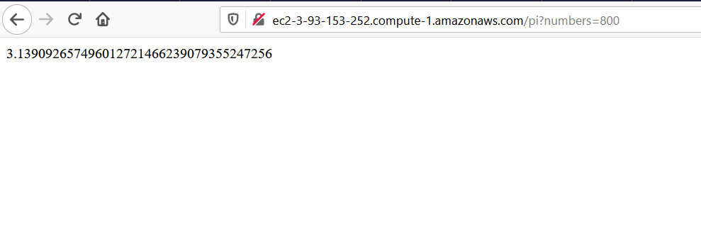
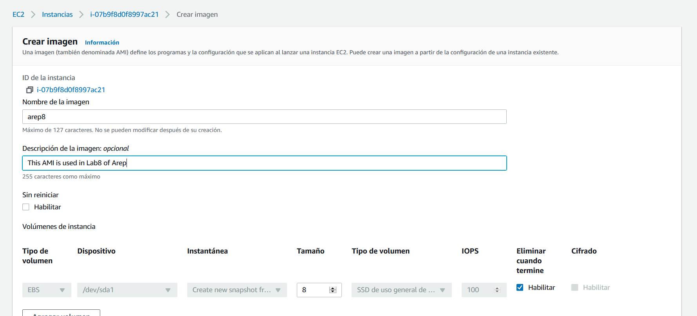

# AREP8

## Description
In this project I configure a app that generate the [Leibniz Series](https://en.wikipedia.org/wiki/Leibniz_formula_for_%CF%80), this permit us to calculate PI. We do a auto scaling configuration in AWS.

## Docker images
- [orlandogk10/arep8](https://hub.docker.com/repository/docker/orlandogk10/arep8)

## Deploy

### Manual deployment
```
git clone https://github.com/orlandoagk/AREP8.git
cd AREP8
mvn compile
mvn clean package
java -cp target/classes:target/dependency/* edu.eci.arep.leibnizserie.Main
```

### Docker deployment
```
sudo docker run -dp 80:4567 orlandogk10/arep8
```

## Tutorial

1. We build the prototype of the application that generate the Leibniz Series, you can search the code in this repository
2. Here we deploy the solution using Docker (you have the above explication)
3. In this image we can see that the solution is already working 
4. To configure that the application run when we reboot the EC2 instance we need to use crontab `sudo crontab -e`, now you put the tag `@reboot /home/ubuntu/start.sh`  the script start.sh is i'll show it down here 
5. Now we need to reboot the machine  and see that the docker container that have the solution is running 
6. To create a Image we click in Actions -> Image and Templates -> Create image  and complete the data 
7. We associate the EC2 instance to a Auto Scaling group called **arep8AutoScaling** 
8. With the Auto Scaling group created we put a scaling policy  and change the capacity (first the red circle, next the blue's) 
9. We probe the auto scaling with 9 petitions using 9 nested curl's with & 
10.  The EC2 instance CPU have 62.2% of charge, remember that the policy that we put said that if the 50% of the EC2 instance CPU is usage a new one is created
11. I put this variables in the capacity of the Auto Scaling Group 
12. We do a review of the activity tag in the Auto Scaling Group and we see that a new instance is created because the policy that we put 

## Conclusions
AWS offer a powerful tool that is a Auto Scaling Group, this help us to keep alive our EC2 instances monitoring the CPU (in this case because the policy), following the tutorial you can see that is a simple tool but reliable.

The capacity to create a AMI of a instance permit us to automated the creation of next instances that we need, for example you can create a Ubuntu image that already have Docker, Java 8, Maven; remember that in the base image of Ubuntu 20.04 LTS don't come with that technology or do the exercise of this project (integrate with a script that run the docker container when the instance is rebooted)

## Tecnology Stack
- [Java 8](https://www.java.com/es/download/)
- [Apache Maven](https://maven.apache.org/)
- [Github](https://www.github.com/)
- [AWS](https://aws.amazon.com/es/)
- [Docker](https://www.docker.com/)
- [Docker Hub](https://hub.docker.com/)

## Author
- [orlandoagk - Github](https://www.github.com/orlandoagk)
- [Orlando Gelves - Linkedin](https://www.linkedin.com/in/orlando-antonio-gelves-kerguelen-11445b1a5/)

## References
- [Docker Docs](https://docs.docker.com)

## Licence
This project is licensed under the GNU General Public License v3.0 - see the [LICENSE](/LICENSE) file for more details.